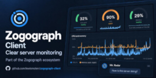
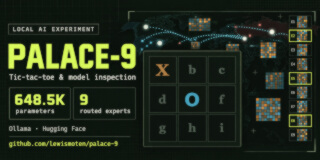
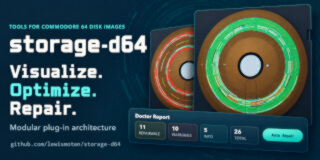
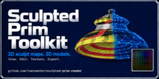
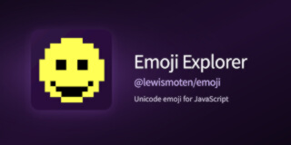

[Career history and resume](https://lewismoten.com/employment/) · [Blog](https://lewismoten.com/blog/) · [Email](mailto:lewismoten@gmail.com) · [LinkedIn](https://www.linkedin.com/in/lewismoten/)

## Start here

- **React and TypeScript:** [Public-ledger explorer](https://github.com/lewismoten/wcfac-general-ledger) — filtering and visualizing public financial data.
- **Applied AI:** [Palace-9](https://lewismoten.github.io/palace-9/) — a playable browser lab and inspector for a compact model trained from scratch.
- **Server operations:** [Zogograph Client](https://github.com/lewismoten/zogograph-client) — telemetry, alerts, and AI-assisted diagnostics with cost tracking.
- **Interactive tools:** [D64 Storage Lab](https://lewismoten.github.io/storage-d64/) — visual disk repair, recovery, and read-efficiency experiments.

## What I work with

- **Front end:** React, TypeScript, JavaScript, accessible interfaces, data visualization, and browser APIs.
- **Applied AI:** PyTorch, model training and validation, MoE architectures, Ollama, llama.cpp, local inference, and tool calling.
- **Services and delivery:** Node.js, PHP, C#/.NET, SQLite and SQL, Linux hosting, Forgejo, CI/CD, and WHM/cPanel automation. 

## Projects

| Preview | Project |
| :--- | :--- |
|  | **Zogograph Client \| AI-assisted server monitoring** PHP/SQLite collectors and a JavaScript dashboard make server telemetry, alerts, and diagnostics readable. An AI assistant calls diagnostic tools and tracks the cost of an investigation. [Source](https://github.com/lewismoten/zogograph-client) · [Videos](https://www.youtube.com/watch?v=OKndBMPknmQ&list=PLaLeerEZeFMs) |
|  | **Palace-9 \| Local model inspection** A playable tic-tac-toe lab pairs a deterministic controller with a compact MoE model trained from scratch. It uses the Qwen2-MoE architecture for Ollama and llama.cpp compatibility without a custom fork; the browser inspects checkpoints locally. [Live demo](https://lewismoten.github.io/palace-9/) · [Source](https://github.com/lewismoten/palace-9) · [Ollama](https://ollama.com/lewismoten/palace-9) · [Hugging Face](https://huggingface.co/lewismoten/palace-9) · [Video](https://www.youtube.com/watch?v=J7bgpmks_KM) |
|  | **D64 Storage Lab \| Repair and optimization** A JavaScript workbench maps Commodore 64 disk sectors and file chains, estimates read efficiency, repairs corruption, restores deleted files, and compares optimized and fragmented layouts. [Live demo](https://lewismoten.github.io/storage-d64/) · [Source](https://github.com/lewismoten/storage-d64) · [Video](https://www.youtube.com/watch?v=cXeIy4AZewY) |
|  | **Sculpted Prim Toolkit \| Three.js editor** Decodes Second Life-style RGB sculpt maps into editable 3D geometry. Camera views, mesh overlays, textures, and vertex tools support PNG, glTF/GLB, OBJ, and STL exports. [Live demo](https://lewismoten.github.io/sculpted-prim-toolkit/) · [Source](https://github.com/lewismoten/sculpted-prim-toolkit) · [Videos](https://www.youtube.com/watch?v=egAIXJwAAHw&list=PLIyz44ZkJ3sk) |
|  | **Data Over Audio \| Web Audio API** Transfers text and binary data through sound using MFSK modulation, packetization, CRC checks, Hamming error correction, interleaving, and repeat requests. [Live demo](https://lewismoten.github.io/data-over-audio/) · [Source](https://github.com/lewismoten/data-over-audio) · [Videos](https://www.youtube.com/watch?v=_6qxB3gKN_E&list=PLEyaach61fdU-OPcb5Aqgah2l6TTsaLia) |
|  | **Emoji Explorer \| Unicode and pixel font** A localized Unicode explorer with version and sequence filters, favorites, keyboard navigation, and offline PWA support. Includes a custom 12 x 12 Pixel Emoji font and pixel editor. [Live demo](https://lewismoten.github.io/emoji/) · [Source](https://github.com/lewismoten/emoji) · [npm](https://www.npmjs.com/package/@lewismoten/emoji) |
|  | **Dreamy Tags \| WordPress plugin** An open-source PHP/Gutenberg plugin for category- and tag-filtered clouds, with exclusion rules and minimum-use thresholds. Published as a block, widget, and shortcode. [Plugin directory](https://wordpress.org/plugins/dreamy-tags/) · [Source](https://github.com/lewismoten/dreamy-tags) |
|  | **Restoring the Signal \| Dialable exhibit** A live installation at Stone Branch Center for the Arts joins Raspberry Pi, Asterisk, and a PHP contribution site. It handles telephone audio, dialplans, transcription, and TTY support. [Live demo](https://phone.lewismoten.com/) · [Source](https://github.com/lewismoten/Phone-Exhibit) · [Videos](https://www.youtube.com/watch?v=kmOV7_2MKPg&list=PLHG0YVBnnA7k) · [Press and photos](https://www.nvdaily.com/nvdaily/dial-i-for-interactive-new-exhibit-celebrates-150-years-of-communication/article_06d37f43-5f2d-5ee3-9621-2dc1853ef4c2.html) |
|  | **QR Code Generator \| Creator and inspector** A browser tool backed by a first-party ES module for mixed segmentation, versions 1-40, Reed-Solomon correction, mask selection, and structural inspection. [Live demo](https://qr.lewismoten.com/) · [Source](https://github.com/lewismoten/qr) |
|  | **Tiny Pockets Press \| Miniature publishing** A modular JavaScript editor for miniature books, with layout and imposition logic and separate interior and cover print/PDF views. [Live demo](https://lewismoten.github.io/Tiny-Pockets-Press/#editor) · [Source](https://github.com/lewismoten/Tiny-Pockets-Press) · [Videos](https://www.youtube.com/watch?v=w9IwuwX7BkE&list=PLAgk77H8yVCA) |
|  | **Shoomi's HomePage \| GeoCities restoration** A 1990s web restoration with a Canvas recreation of its Java applet marquee, Web Audio MIDI playback, and a browser version of a Visual Basic color editor. [Live demo](https://lewismoten.github.io/Athens-Acropolis-4507/) · [Source](https://github.com/lewismoten/Athens-Acropolis-4507) · [Videos](https://www.youtube.com/watch?v=UgJgb0VUaHw&list=PLI4A73VhrZT4) |

## Beyond code

I volunteer with local history and library projects, started a LEGO users group, and sometimes perform as a clown. I like projects that connect technology with something people can actually use, explore, or enjoy.

[Code Jamboree LLC](https://www.codejamboree.com/) · [Schedule a conversation](https://calendly.com/lewismoten)
